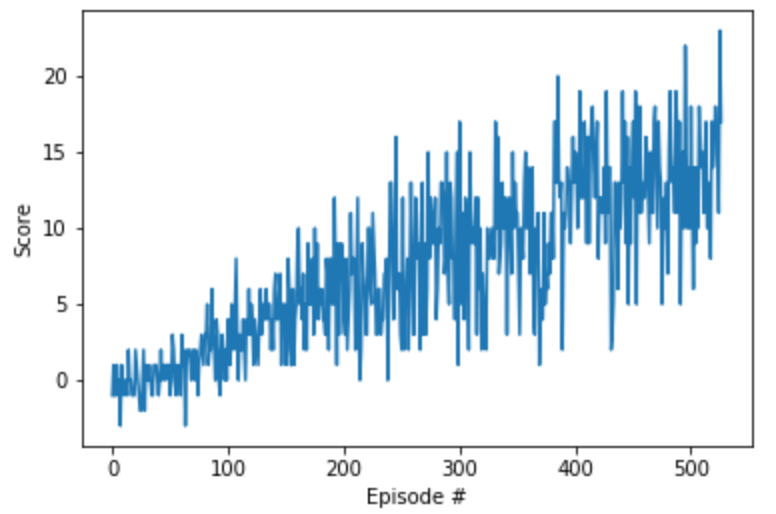

# Navigation Project Report

### Introduction

In this project, I used Deep Q network to train an agent to navigate (and collect bananas!) in a large, square world.  

A reward of +1 is provided for collecting a yellow banana, and a reward of -1 is provided for collecting a blue banana.  Thus, the goal of your agent is to collect as many yellow bananas as possible while avoiding blue bananas.  

The state space has 37 dimensions and contains the agent's velocity, along with ray-based perception of objects around agent's forward direction.  Given this information, the agent has to learn how to best select actions.  Four discrete actions are available, corresponding to:
- **`0`** - move forward.
- **`1`** - move backward.
- **`2`** - turn left.
- **`3`** - turn right.

The task is episodic, and in order to solve the environment, your agent must get an average score of +13 over 100 consecutive episodes.

### Learning Algorithm

#### DQN Network architecture
There are 4 fully connected layers in my DQN, with RELU activation function.

```
state_size = 37
fc1_units = 48
fc2_units = 64
fc3_units = 48
fc4_units = 36
action_size = 4
```

#### Hyper-parameter list

```
BUFFER_SIZE = int(1e5)  # replay buffer size
BATCH_SIZE = 64         # minibatch size
GAMMA = 0.99            # discount factor
TAU = 1e-3              # for soft update of target parameters
LR = 5e-4               # learning rate 
UPDATE_EVERY = 4        # how often to update the network
```

```
n_episodes = 2000
max_t = 1000
eps_start = 1.0
eps_end = 0.01
eps_decay = 0.995
```

### Plot of the Rewards
It trains relatively quickly. It goes the reward score 13 in Episode 600 average score, and above score 15 in Episode 697 average score.

```
Episode 100	Average Score: 1.97
Episode 200	Average Score: 6.89
Episode 300	Average Score: 9.80
Episode 400	Average Score: 11.37
Episode 500	Average Score: 12.53
Episode 600	Average Score: 13.27
Episode 697	Average Score: 15.02
```



### Ideas for Future Work

1. Hyper-parameter optimization;
2. Try other learning algorithms (prioritized experience replay, or rainbow) and compare the performance.